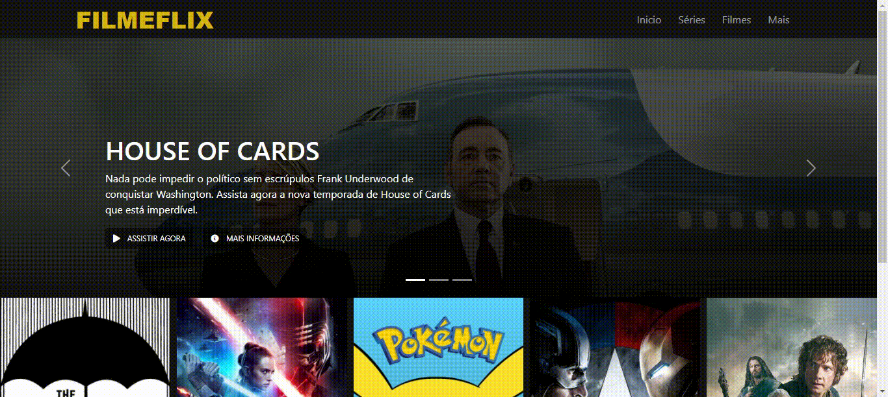

# Recriando a Interface da Netflix

> Projeto criado na Digital Innovation One About na [Digital Innovation One](https://digitalinnovation.one/)! Recriando a interface da Netflix com HTML, CSS e JS.

Fiz algumas alterações no projeto e utilizei o Bootstrap. Criei um carrosel de filmes na página inicial, permitindo colocar várias obras em destaque. Segue a captura de tela: 

!

- Para rodar, baixe o projeto e abra o arquivo index.html.

